# Quizzly
>  Quizzly – Smart Quizzes. Smarter Kids.

>> This was created during AMUHacks4.0, under the [theme of Smart Education](https://amuhacks-4.vercel.app/#themes) by Team **ByteClub**


---
> [!Note] Please wait a few seconds at first for the frontend, when it make the first call to render, it takes some time to spin up a sleeping instance.

For a live demo, please see [https://quizlyio.netlify.app](https://quizzlyio.netlify.app/)

The Backend API is public and hosted on https://quizzly-backend.onrender.com/docs

> [!IMPORTANT]
> [Render](https://render.com) — the cloud service we use for deployment — spins down a free web service that goes 15 minutes without receiving inbound traffic, and spins it back up whenever a request is received. It causes a noticeable delay for the first few requests until the service is back up and running, and the browser page may hang in the meantime. Kindly give it a couple of minutes.

> Why Quizzly?
In an age where every child learns differently, Quizzly gives parents full control to test, track, and train their children at their own pace.
Whether it's basic math, science concepts, or general knowledge, Quizzly brings structure, gamification, and AI-driven insights into a child's learning journey.


## Features:

- Parent-Centric Quiz Creation
  - Parents/tutors can create quizzes tailored to different topics and varying levels of difficulty.
  - Quizzly auto-generates curated question sets based on selected topics – fully customizable by the parent.
  - Questions can be edited, modified, and reused to suit each child’s learning needs.
  - Parents can assign quizzes to children using secure 4-digit PINs.
- Child-Friendly Participation
  - Kids can start a quiz by simply entering a 4-digit PIN and a fun, unique name (like their favorite player or pet).
> [!Tip] Choose a different fruit for more fun :\
  - No accounts. No complexity. Just pure learning and fun.
- Smart Feedback & Analytics
  - After submitting the quiz, children get immediate feedback:
  - Correct and incorrect questions
  - Detailed explanations
  - Personalized results
  - Scores and answers are logged for parents to monitor and mentor effectively.
- Beautiful Performance Analytics
  - Parents receive clear and intuitive analytics dashboards:
  - Track strengths and weaknesses
  - Visual progress over time
  - Topic-wise performance breakdown
  - Helps in identifying learning gaps and mentoring efficiently.
- AI-Powered Learning Assistant
    - Quizzly automatically:
        - Analyzes incorrect answers
        - Suggests helpful resources – articles, videos, lectures
    - Children learn faster, deeper, and more confidently.

---

## Demo Video
See the project demo video on [Youtube](https://www.youtube.com/watch?v=rZ0rmfS2lOA&feature=youtu.be)


## Diagrams

### ER Diagram

<div align="center">
  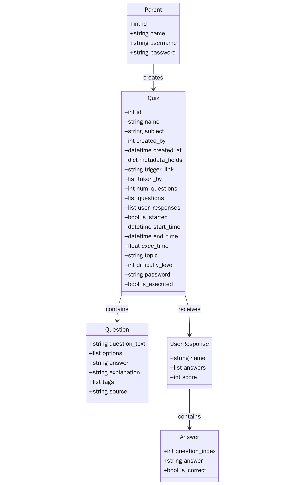
</div>

### User Flow Diagram

<div align="center">
  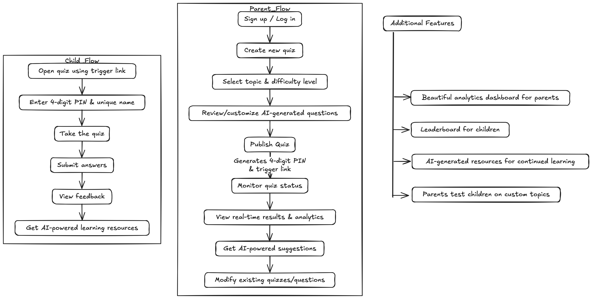
</div>

### Planning Diagram

<div align="center">
  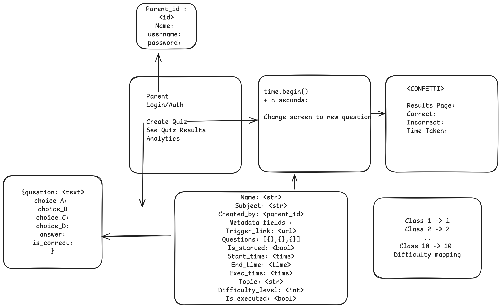
</div>


---

### Ideal For:
- Homeschooling setups
- After-school learning
- Remote tutoring
- Teachers in micro classrooms
- Parents mentoring kids during exams


## Setup


### Using Git Clone

- Backend

First things first, create a virtual environment and activate it.
We will use `Dockerfile` to orchestrate everything.

> [!NOTE]
> Before starting, please ensure port 8000 is open. You can use `lsof -i :8000` for a quick check.

```sh
git clone https://github.com/rajuljha/ByteClub_AMUHACKS4.0
cd ByteClub_AMUHACKS4.0
mv .env.sample .env
```
Populate the environment variables after seeing in the env.sample file.

Install dependencies and run the server.

```sh
pip install -r requirements.txt
uvicorn quizzly.main:app --reload
```

### Using Docker

If you don't want the hassle, pull the official backend image from the Dockerhub registry, 
> [!NOTE]
> This image is built for `linux/amd64` platform only. If you want to run on a different host, please install locally instead.

```sh
docker pull rjknightmare/quizzly-backend
docker run -p 8000:8000 --env-file .env rjknightmare/quizzly-backend:latest
```

The backend will be up and running on https://localhost:8000 (Visit /docs endpoint for complete API documentation powered by Swagger UI).


> [!NOTE]
> Before starting, please ensure port 8080 is open. You can use `lsof -i :8000` for a quick check.

- Frontend: (Make sure to have node package manager (npm) installed on your device)
```sh
cd frontend
npm install
npm run dev
```

If all goes well, the app should be live at http://localhost:8080.


## Tech Stack

- Backend: FastAPI (Python 3.10), MongoDB, Pydantic, Uvicorn
- Frontend: Vite + React + TypeScript
- Deployment: Dockerized backend, Render-friendly, ENV-variable support
- Extras: AI suggestions, RESTful APIs, analytics dashboard, real-time feedback

## Screenshots


---

<div align="center">
  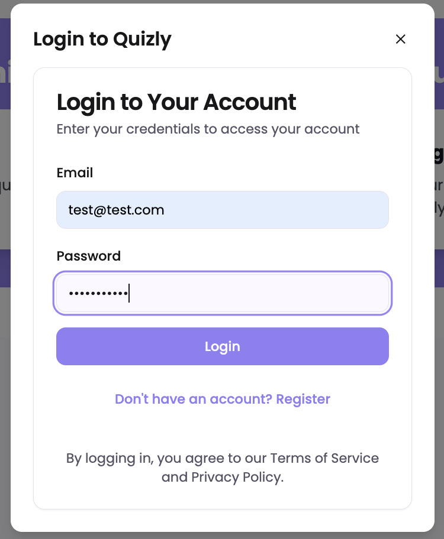
</div>

---

<div align="center">
  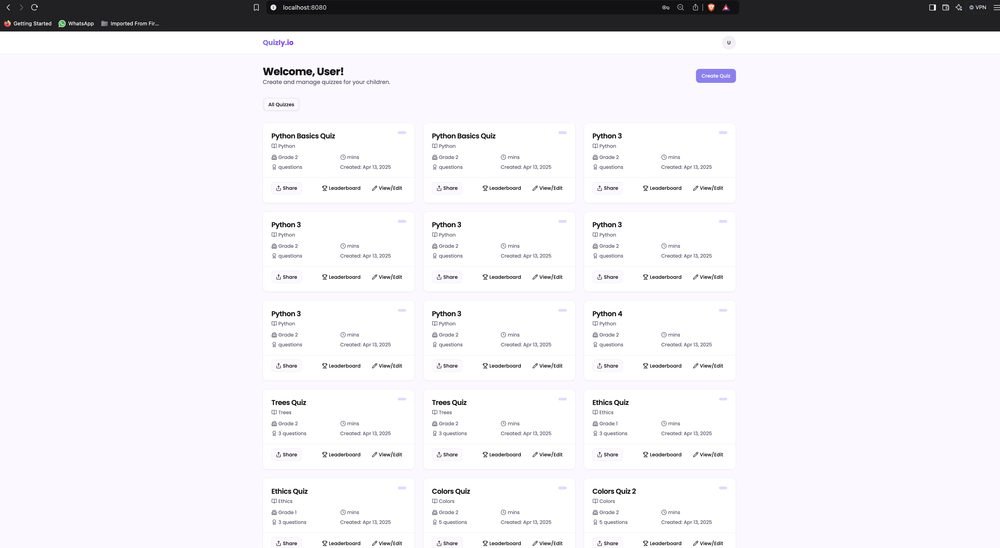
</div>

---

<div align="center">
  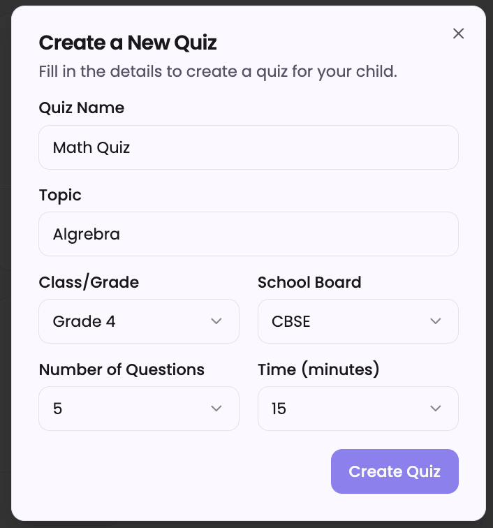
</div>

---

<div align="center">
  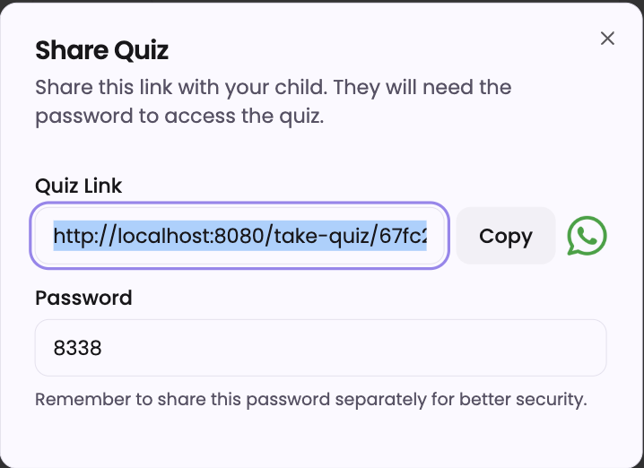
</div>

---

<div align="center">
  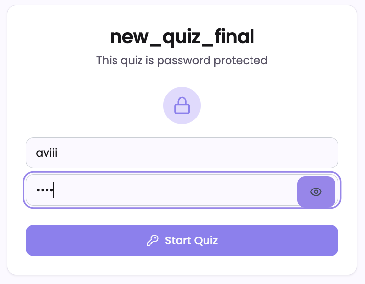
</div>

---

<div align="center">
  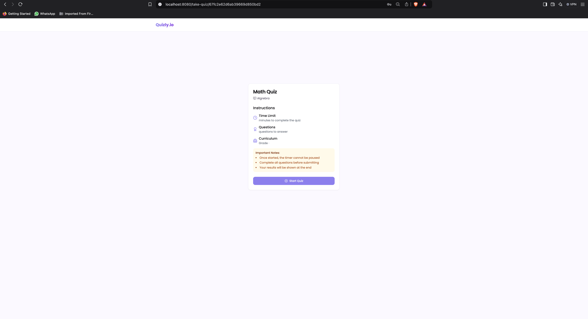
</div>

---

<div align="center">
  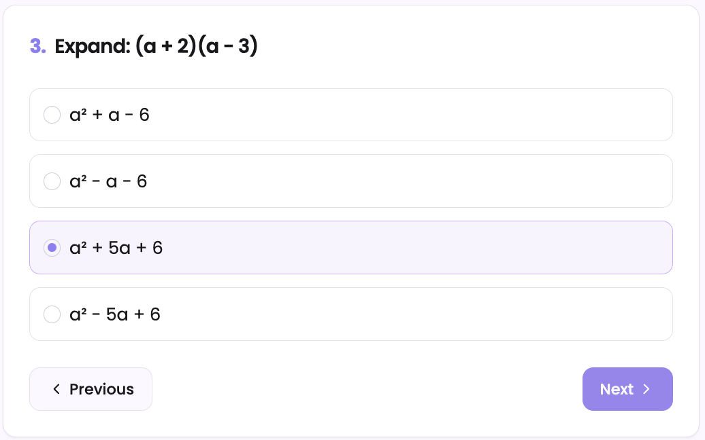
</div>

---

<div align="center">
  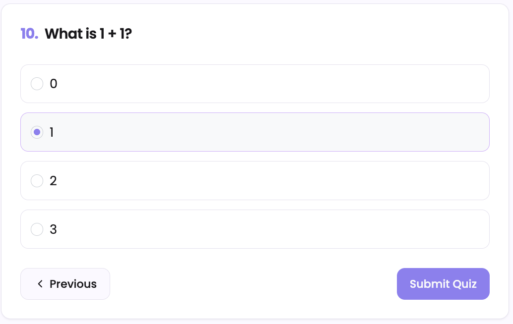
</div>

---

<div align="center">
  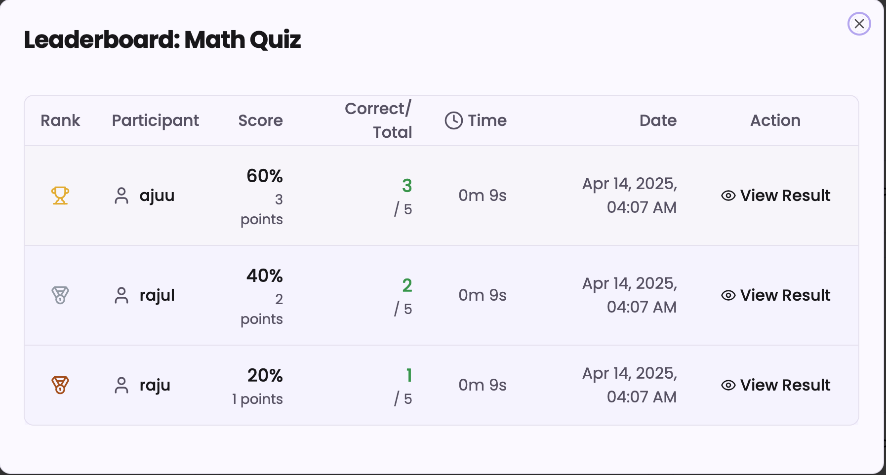
</div>

---

<div height=auto>

<div align="center">
  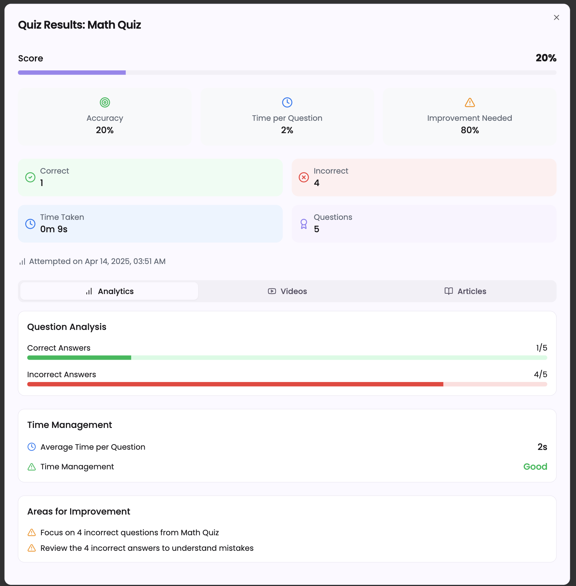
</div>

<div align="center">
  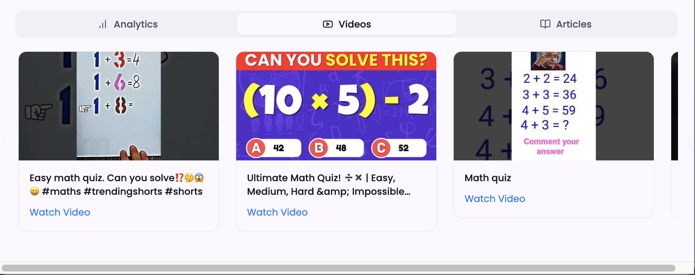
</div>

<div align="center">
  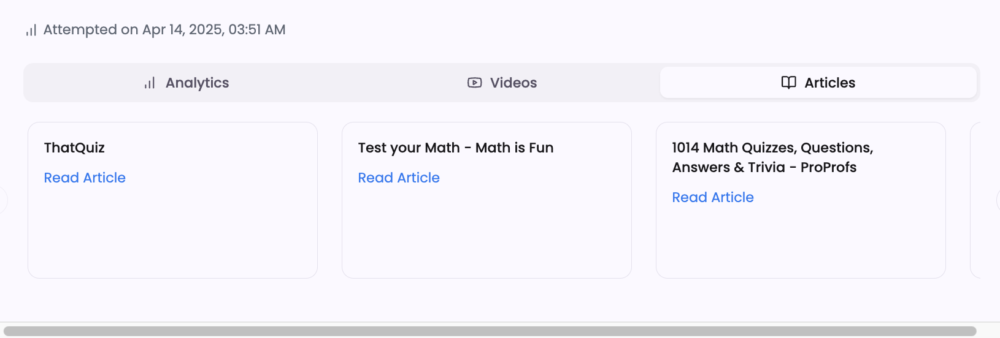
</div>
</div>

## Cost Analysis

The total cost of running Quizzly largely depends on your backend hosting, database, task queues, and frontend delivery. Considering the following assumptions for usage:

- 📊 10,000 quizzes per day
- 🔁 25,000 total API calls/day (including quiz start/end, question fetch, results storage)
- 👪 Active user load of ~100 concurrent users during peak hours
- 🎯 Moderate AI resource usage for recommendations

We can estimate the monthly infrastructure costs assuming you're deploying on AWS:


| Resource	                            | Purpose	                                | On-demand Hourly Price	| Approximate Monthly
| Amazon EC2 `t3.micro` FastAPI backend	| To run Uvicorn ASGI server	            | $0.0104	                | ~$7.50
| Amazon RDS `db.t4g.micro` MongoDB alt	| For managing quiz, user, and result data	| $0.016	                | ~$11.52
| Amazon S3 / `CloudFront` optional	    | For serving static frontend via CDN	    | ~free-tier or < $1	    | ~$1.00

Total Estimated Monthly Cost: ~$43 - $46/month


## 👥 Team Members

| Name               | GitHub                                                  | LinkedIn                                              |
|--------------------|---------------------------------------------------------|-------------------------------------------------------|
| Rajul Jha          | [@rajuljha](https://github.com/rajuljha)                | [Rajul Jha](https://www.linkedin.com/in/rajuljha/)    |
| Aarish Shah Mohsin | [@aarishshahmohsin](https://github.com/aarishshahmohsin)| [Aarish Shah](https://www.linkedin.com/in/aarish-sm/) |
| Syed Ali Ul Hasan  | [@syedali237](https://github.com/syedali237)            | [Syed Ali](https://www.linkedin.com/in/syedali237/)   |
